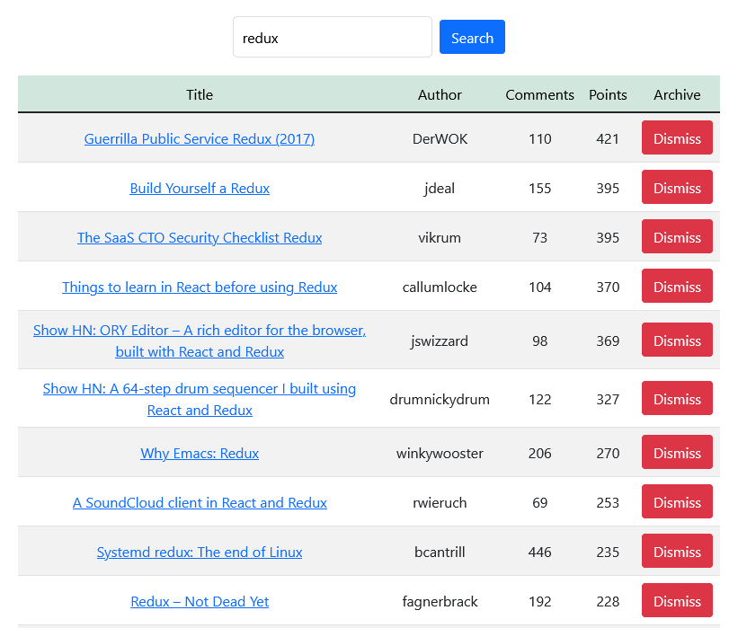

# Hacker News

## Tech Stack

 
 
HTML, CSS, javaScript, Jest, Bootstrap, font Awesome

 
 

---

## About this project
This project was made while reading the book "The Road To Learn React".

I learned basic and advanced concepts in React.

I did all the extra tasks suggested for the app and added some improvements like the "less" button, responsiveness and small css tweaks.

## Links

### heroku link
https://safe-savannah-95089.herokuapp.com

## The book (The Road To Learn React)

## preview

---

## Available Scripts

In the project directory, you can run:

### `npm start`
Runs the app in the development mode.\
Open [http://localhost:3000](http://localhost:3000) to view it in your browser.

### `npm test`
Runs the tests.

---

## Author

- [David Nunes](https://www.github.com/Dnuns)