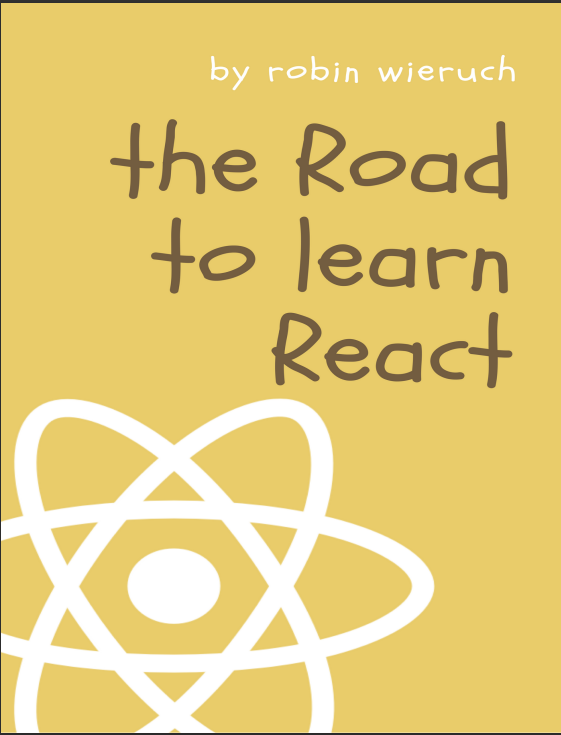
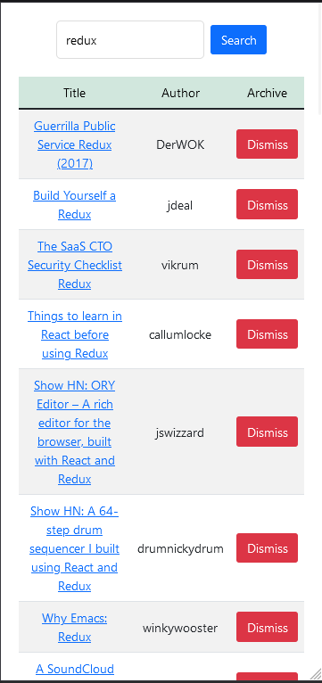

# Hacker News

## Tech Stack

React, HTML, CSS, javaScript, Jest, Bootstrap, font Awesome

---

## About this project
This project was made while reading the book "The Road To Learn React".

I learned basic and advanced concepts in React.

I added some improvements like responsiveness with bootstrap and small css tweaks.

## Links

### Vercel link
https://hacker-news-roan.vercel.app

## The book (The Road To Learn React)

## preview

---

## Available Scripts

In the project directory, you can run:

### `npm start`
Runs the app in the development mode.\
Open [http://localhost:3000](http://localhost:3000) to view it in your browser.

### `npm test`
Runs the tests.

---

## Author

- [David Nunes](https://www.github.com/Dnuns)
